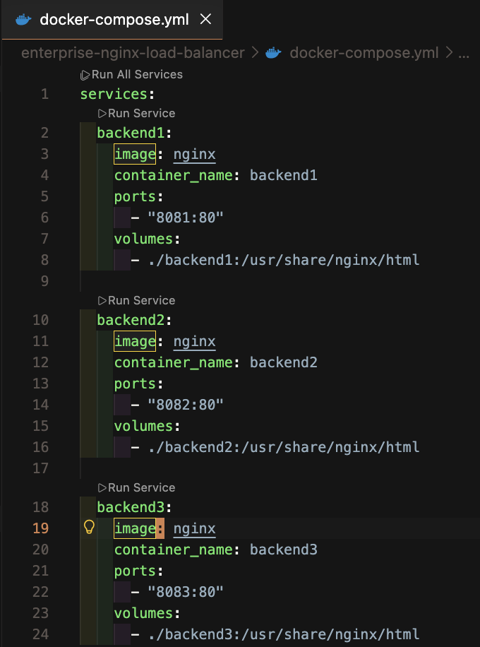
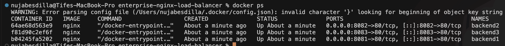
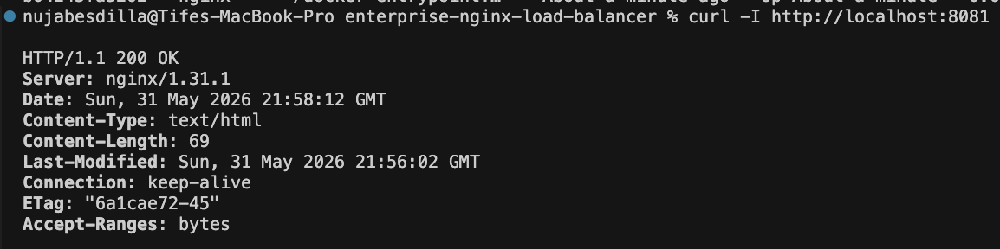
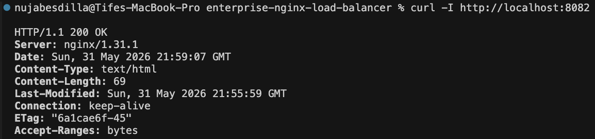
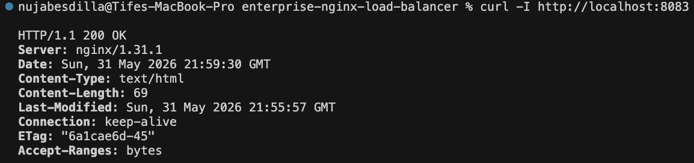
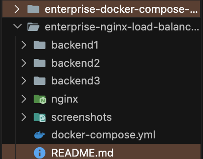

# Enterprise NGINX Load Balancer

## Overview

Configured a multi-backend NGINX infrastructure environment using Docker containers.

This project demonstrates backend service deployment, container orchestration, HTTP validation, and infrastructure documentation.

## Architecture

```text
Client
   ↓
NGINX Load Balancer
   ↓
Backend 1
Backend 2
Backend 3
```

## Technologies

- Docker
- Docker Compose
- NGINX
- Linux
- VS Code

## Commands Used

```bash
docker compose up -d
docker ps
curl -I http://localhost:8081
curl -I http://localhost:8082
curl -I http://localhost:8083
```

## Screenshots

### Docker Compose Configuration


### Running Backend Containers


### Backend 1 Validation


### Backend 2 Validation


### Backend 3 Validation


### Project Structure


## Key Outcomes

- Deployed multiple backend services
- Validated backend availability
- Practiced infrastructure documentation
- Strengthened Docker and NGINX workflows